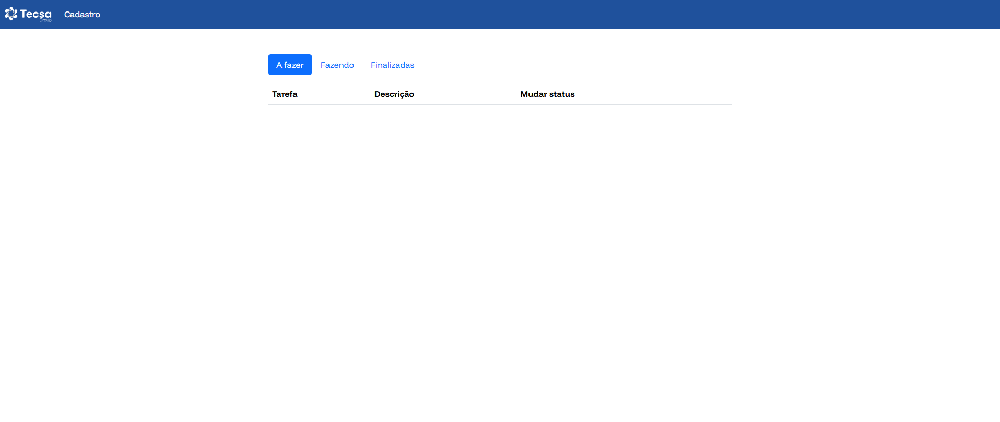
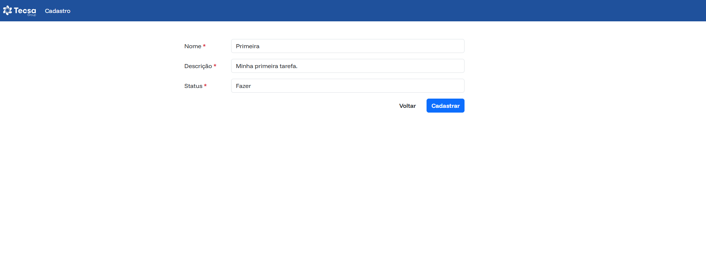
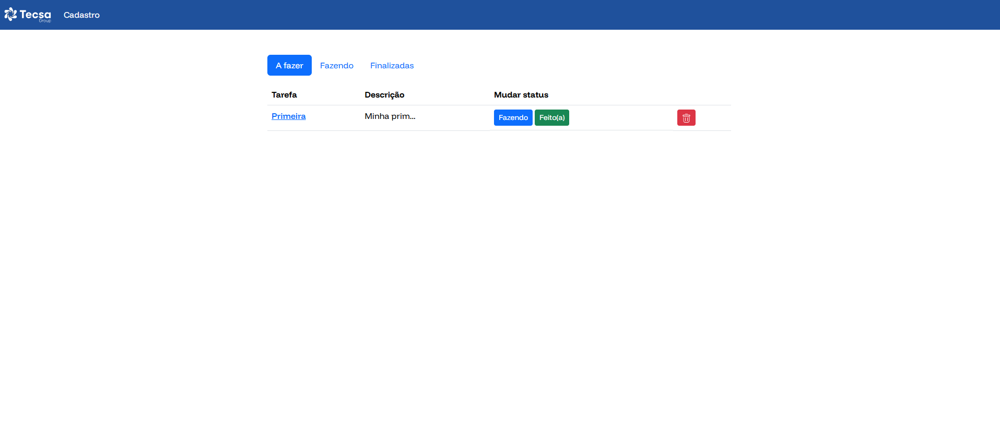
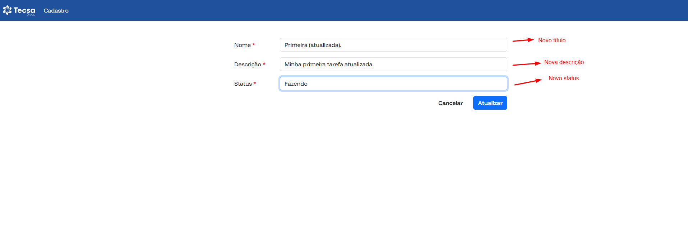
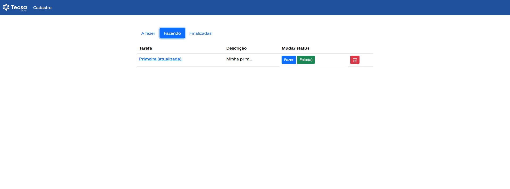

# TecsaGroup - Desafio técnico

Desafio técnico proposto pela [TecsaGroup](https://tecsagroup.com.br).

## Descrição do teste

Criar uma aplicação de gerenciamento de tarefas usando alguma linguagem de backend (de preferência PHP 7.4 ou superior) e para o frontend, utilizar HTML,
CSS, JavaScript e Bootstrap. Ambos, de preferência **sem frameworks**.

## Requisitos técnicos

- Backend
    - Criar uma API RESTful com as seguintes rotas:
        - ```POST``` /task (Para criar uma nova tarefa).
        - ```GET``` /tasks (Para listar todas as tarefas).
        - ```GET``` /task/{id} (Para buscar uma tarefa específica pelo ID.
        - ```PUT``` /task/{id} (Para atualizar uma tarefa específica).
        - ```DELETE``` /task/{id} (Para deletar uma tarefa específica).
    - Cada tarefa deve conter:
        - ```id``` Identificador único gerado, gerado automaticamente.
        - ```title``` Título da tarefa.
        - ```description``` Descrição da tarefa.
        - ```status``` Status da tarefa (Pendente, em andamento ou concluída).
        - ```created_at``` Timestamp de criação.
        - ```updated_at``` Timestamp de atualização.
    - Utilzar o MySQL como base de dados para a aplicação.

- Frontend
    - Usar HTML, CSS (Bootstrap) e JS para construir uma interface simples e responsiva.
    - Funcionalidades:
        - Tela de listagem de tarefas (em uma tabela).
        - Formulário para criar e atualizar tarefas.
        - Botão para excluir uma tarefa.
        - Alterar o status da tarefa através de botões (Ex.: "Concluir" ou "Reabrir").
        - Utilizar AJAX para comunicação com a API.

- DevOps
    - Criar um ambiente docker para executar a aplicação.
    - Criar os serviços necessários (Ex.: PHP, Apache, MySQL, etc...).
    - Utilizar Docker Compose para gerenciar os containers e subir todas a aplicação com um único comando.
    - Executar o projeto na porta local ```9000```.

- Extras
    - Autenticação básica no backend usando tokens JWT.
    - Validação de dados no frontend e backend.
    - Organização do código frontend utilizando módulos ES6.
    - Boas práticas de segurança, como sanitização de entrada de dados.
    - Testes unitários ou de integração para o backend.

- Critérios de Avaliação
    - Qualidade do Código:
        - Clareza, organização e aderência a boas práticas.
        - Uso de padrões de projeto (se necessário).
    - Funcionalidade:
        - Todas as funcionalidades descritas estão implementadas corretamente.
    - Design e Usabilidade:
        - Interface responsiva e intuitiva.
    - Configuração do Ambiente:
        - Facilidade para configurar e rodar a aplicação usando Docker.
    - Extras:
        - Implementação dos diferenciais sugeridos.


## Visão geral

Conforme os requisitos, a aplicação roda em um container com ```PHP 8.2``` e Apache. O banco de dados roda em um container separado e ambos estão ligados pela mesma rede configurada (ver ```docker-compose.yml``` para mais detalhes). O container de PHP inclui o [composer](https://getcomposer.org) para gerenciamento dos pacotes necessários.

**Não foram utilizados frameworks**, mas o projeto tem as seguintes dependências:

- [```pecee/simple-router```](https://github.com/skipperbent/simple-php-router) para roteamento.
- [```vlucas/phpdotenv```](https://github.com/vlucas/phpdotenv) para manipulação de variáveis ambiente.

As dependências são instaladas no momento de inicialização do container.

As instruções de setup, consideram que você tem ```Docker``` e ```Docker compose``` devidamente instalados. Na raiz do projeto, é possível encontrar um arquivo chamado ```Taskfile.yml```. Esse arquivo é parecido com o arquivo ```docker-compose.yml``` **no sentido de ser um arquivo de instruções para alcançar um determinado objetivo**. Ele é manipulado pela [Task CLI](https://taskfile.dev) e foi configurado para ser o facilitador para subir e derrubar a aplicação (não que isso não possa ser feito facilmente também pela CLI do Docker Compose). Caso você queira, pode subir toda a aplicação via Task CLI usando o comando ```task setup```, parar todos os serviços com o comando ```task stop``` e inicializa-los novamente com ```task start```. Esses comandos estão configurados no arquivo ```Taskfile.yml``` mas para que eles funcionem, você precisa da Task CLI instalada na sua máquina. Para isso acesse o [guia de instalação](https://taskfile.dev/installation).

A Task CLI não é necessária para subir esse projeto. O comando ```docker compose up -d --build``` já faz isso (e ```docker compose down``` para derrubar os serviços). Mencionei ela simplesmente por que é preferência minha em ambiente de desenvolvimento, uma vez que posso precisar executar comandos mais longos sem ficar decorando ou copiando/colando.

## Arquitetura

- O arquivo de configuração do PHP (```php.ini```) que é considerado dentro do container, está em ```docker/php/php.ini``` para quaisquer configurações adicionais que possam ser feitas (não é necessário para esse projeto).

- O arquivo de configuração do apache, para requisições HTTP (sites available) está em ```docker/php/apache/sites-available/000-default.conf``` para quaisquer configurações adicionais que possam ser feitas (não é necessário para esse projeto).

- O ```Dockerfile``` está em ```docker/php/Dockerfile```.

- A aplicação em si, está em ```app/``` e inicializa em ```app/public/index.php```.

- Módulos JavaScript (para manipulação completa da interface)
    - ```app/public/modules/task```

- Controller PHP em ```app/src/Controllers```
- Repositories PHP em ```app/src/Repositories``` (faz o papel de Model)
- Services PHP em ```app/src/Services```
- Views em ```app/src/views``` divididas em:
    - Template (para uma interface com configuração única): ```app/src/views/template```
    - Componentes (separa componentes em comum para todas as telas): ```app/src/views/components```
    - Telas de manipulação das tarefas (listagem, atualização e criação): ```app/src/views/tasks```
    - Container para gerenciar tudo isso (onde a troca de telas realmente acontece): ```app/src/views/container.php```
- Conexão com o banco de dados em ```app/src/Database/Connection.php```. Usei um [singleton](https://refactoring.guru/pt-br/design-patterns/singleton) para fornecer um ponto de acesso global para a instância da conexão.

## Seup

<video width="100%" height="380" controls>
  <source src="./docs/preview/2025-03-14.mp4" type="video/mp4">
</video>

## Atenção!

Caso você tenha recebido o mesmo erro de instalação do x-debug, apenas execute novamente o comando ```docker compose up -d```.

- Clone esse repositório para o seu ambiente de trabalho
```sh
git clone git@github.com:felipeoli7eira/tecsagroup-challenge.git
```

- Entre na pasta criada
```sh
cd tecsagroup-challenge
```

- Suba os serviços configurados

- Task CLI
```sh
task setup
```

- Docker compose
```sh
docker compose up -d
```

Caso você tenha usado a CLI do docker compose, essas etapas adicionais devem ser realizadas:

- Instale as dependências
```sh
docker exec -it phpapch_service composer install
```

- Crie o arquivo .env
```sh
docker exec -it phpapch_service cp .env.example .env
```

Se tudo ocorreu bem, você pode acessar ```http://localhost:9000``` e ver a seguinte tela:



Use o software de sua preferência para visualizar o banco de dados.
- host: ```localhost```
- porta: ```3306```
- usuário: ```root```
- senha: ```root```
- banco: ```app```

Importe a collection da API no seu postman, localizada em ```docs/postman```.

Inicialmente (e obviamente) não há tarefas para serem listadas. Comece a criar tarefas no link "Cadastro", localizado na barra de navegação.



Após clicar no botão "Cadastro", você será redirecionado para a tela inicial, onde poderá ver sua mais nova tarefa sendo listada.



As tarefas estão categorizadas pelos seus status possíveis (a fazer, fazendo e finalizada). Você pode facilmente alterar o status da tarefa pelos botões exibidos na coluna "Mudar status" da tabela, ou ainda, clicando no nome da tarefa. Ao escolher a última opção, você será levado para o formulário de atualização, onde pode mudar o restante das informações também.



Ao clicar no botão "Atualizar", você será levado para a tela inicial e poderá ver os novos dados da sua tarefa. Ela estará localizada na aba que correponde ao status que você escolheu no formulário de atualização (no exemplo, o status foi alterado para "Fazendo").



Cada tela tem seu próprio módulo ES6 que faz a manipulação de tudo e comunicação com a api (```http://localhost:9000/api```).

- Tela de listagem: ```app/public/modules/task/read.js``` que inicializa o serviço ```app/public/modules/task/services/read-task.service.js```
- Tela de cadastro: ```app/public/modules/task/create.js``` que inicializa o serviço ```app/public/modules/task/services/create-task.service.js```
- Tela de atualização: ```app/public/modules/task/update.js``` que inicializa o serviço ```app/public/modules/task/services/update-task.service.js```

Fique à vontade para criar novas tarefas e testar a aplicação.

## Network

<a href="https://www.linkedin.com/in/felipeoli7eira" target="blank">
    
</a>

<a href="https://instagram.com/oli7eirafelipe" target="blank">
    
</a>

## Felipe Oliveira - Desenvolvedor full stack


